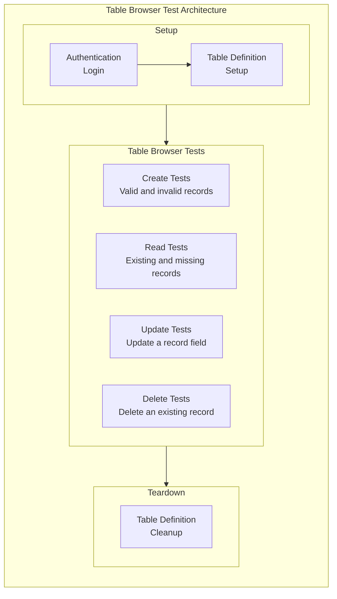

# Neptune DXP QA Assessment

This project contains a Playwright end-to-end test suite for the Neptune DXP
Table Browser. The suite authenticates once, creates the table definition used
by the tests, executes the Table Browser scenarios, and removes the table
definition during teardown.

> **AI assistance disclosure**
>
> AI assistance was used during this assessment for documentation research,
> language refinement, debugging support, and suggestions related to project
> structure and Docker configuration. All technical decisions, test scenarios,
> code, and documented findings were reviewed, understood, executed, and
> validated by me.

## Installation and test execution

### Requirements

- Docker and Docker Compose (recommended), or Node.js 20+ for local execution
- The environment variables shown in `.env.example`

Create the local environment file:

```bash
cp .env.example .env
```

On native Windows PowerShell, use:

```powershell
Copy-Item .env.example .env
```

Set secure values for both variables:

```dotenv
ADMIN_PASSWORD=your-admin-password
SESSION_SECRET=your-long-random-session-secret
```

Generate a cryptographically secure session secret with Node.js (works on
Linux, WSL, macOS, and Windows):

```bash
node -e "console.log(require('node:crypto').randomBytes(32).toString('hex'))"
```

Alternatively, on systems with OpenSSL installed:

```bash
openssl rand -hex 32
```

Copy the generated value into `.env` as `SESSION_SECRET`. The secret should be
kept private and must not be committed to source control.

### Operating system compatibility

The recommended Docker workflow is expected to work on:

- Linux with Docker Engine and the Docker Compose plugin.
- Windows through Docker Desktop using Linux containers. Running the repository
  inside WSL2 is also supported and is generally the smoothest Windows setup.
- macOS through Docker Desktop.

The Neptune container is explicitly configured as `linux/amd64`. It runs
natively on most Linux and Windows/WSL setups. On Apple Silicon Macs, Docker
Desktop uses amd64 emulation, so startup and test execution may be slower.

Playwright can also run directly on Linux, Windows, and macOS. In that case,
Node.js and the Playwright browser dependencies must be installed on the host,
while Neptune can continue to run through Docker. Shell commands shown in this
README use Bash syntax unless a PowerShell alternative is provided.

### Start and configure Neptune

Before running the test suite for the first time, pull the required images and
start the Neptune containers:

```bash
docker compose pull
docker compose up -d neptune
```

When the containers are healthy, open `http://localhost:8080` in a browser and
complete Neptune's initial setup:

1. Sign in with the `admin` user and the initial password set as
   `ADMIN_PASSWORD` in `.env`.
2. When prompted, reset the administrator password.
3. Sign in to Neptune with the new password.
4. Add a valid Neptune licence in the platform.
5. Update `ADMIN_PASSWORD` in `.env` to the new administrator password. The
   automated tests use this value to sign in.

This manual configuration is required only for a new Neptune data volume. Do
not run the tests until the password has been reset and a valid licence has
been added.

### Run with Docker (recommended)

After completing the Neptune setup above, build the Playwright image and run
the complete test suite headlessly:

```bash
docker compose --profile tests run --rm --build playwright
```

To stop the application:

```bash
docker compose down
```

To also remove the persisted Neptune volume and start from a completely clean
environment:

```bash
docker compose down --volumes
```

Warning: removing the volume permanently deletes the local Neptune data.

### Run locally

First complete the Neptune setup described in
[Start and configure Neptune](#start-and-configure-neptune).

Install the Node.js dependencies and Playwright browsers:

```bash
npm ci
npx playwright install --with-deps
```

Run the complete suite:

```bash
npm run test:e2e
```

This runs all setup, Table Browser, and teardown projects headlessly in
Chromium, Firefox, and WebKit. It is the standard command for validating the
complete suite.

Run the tests with a visible Chromium browser:

```bash
npm run test:e2e:headed
```

This runs only the Chromium project in headed mode. Its setup dependencies and
teardown are still included. It is useful for watching the interactions and
investigating UI behaviour.

Open Playwright's interactive test UI:

```bash
npm run test:e2e:ui
```

UI mode lets you select and rerun individual tests, inspect every test step,
view the browser state, and debug locators interactively.

Open the most recent HTML report with:

```bash
npx playwright show-report
```

The target URL defaults to `http://localhost:8080`. It can be overridden with
the `BASE_URL` environment variable.

## Test architecture



The Playwright projects execute in the following order:

1. `auth-setup` logs in as the administrator and saves the authenticated browser
   state.
2. `table-definition-setup` creates the `playwright-test-qa` table definition if
   it does not already exist.
3. Chromium, Firefox, and WebKit execute the Table Browser tests using the saved
   authentication state.
4. `table-definition-teardown` removes the test table definition after all
   dependent projects finish, including when a test fails.

Each CRUD test creates and manages its own data. The Read, Update, and Delete
tests do not depend on the record created by `create.spec.ts`.

## Coverage

The automated suite covers:

- Successful administrator login and authenticated-state reuse.
- Creation and cleanup of the test table definition.
- Creation of a valid expense record.
- Rejection of a record that omits the mandatory `category` field, including
  validation of the displayed error and confirmation that the record was not
  persisted.
- Reading a created record and validating its description, amount, category,
  date, and paid status.
- Searching for a non-existing record and validating the empty result.
- Updating selected fields and confirming that the changes persist after the
  table is reopened.
- Deleting a created record and confirming that it can no longer be found.
- Cross-browser execution in Chromium, Firefox, and WebKit.

## Assumptions and Expected Behaviour

The following assumptions about the platform guided the testing approach:

- Table Browser is expected to validate input according to the data type and constraints configured in the Table Definition.
- Integer fields are expected to reject decimal values.
- Numeric fields are expected to reject values outside the range supported by their configured data type (i.e.: smallint, bigint).
- Required fields are expected to reject empty values.
- Invalid values are expected to produce clear validation feedback and must not be persisted.
- Valid values are expected to be stored and displayed without unintended modification or loss of precision.

During exploratory manual testing, these assumptions were not consistently confirmed. For example, an integer field accepted decimal values, while a smallint field accepted values outside its expected range. These findings are documented in the manual testing assessment report.

## Locator strategy

The locator strategy prioritises elements as a user perceives them rather than
implementation details. Tests primarily use Playwright's accessible locators:

- `getByRole()` for buttons, headings, dialogs, rows, and form controls.
- Accessible names and visible labels to distinguish elements.
- `getByPlaceholder()` where the login inputs do not expose a more suitable
  accessible label.
- Exact matching where similar controls exist on the same page.
- Locators scoped to a dialog, toolbar, row, or panel to reduce ambiguity.

This approach makes the tests easier to understand and less dependent on HTML
structure, generated IDs, or styling classes. It also exercises the same
accessible information available to users of assistive technologies.

User-facing locators must still account for responsive behaviour. A control
that is visible in the configured desktop viewport may be moved, collapsed, or
hidden at another screen size. The current scenarios target the desktop device
profiles configured in Playwright; additional viewport sizes would require
explicit responsive coverage and, where the user flow changes, viewport-aware
interactions.

One exception is the SAP table row selector used by the Delete scenario. The
control does not expose a stable user-facing accessible name, so the test uses
the visible `.sapUiTableRowSelectionCell` as a narrow fallback.

## What I would improve with another day

- **Evaluate safe parallel execution.** The current suite uses one worker because
  Neptune locks the shared table during editing. I would first measure whether
  the execution-time improvement justifies the additional complexity. If it
  does, I would isolate each browser and worker with its own table definition
  and clean up every generated table after the run.

- **Expand negative coverage after clarifying validation behaviour.** Some
  update validations are currently inconsistent. For example, clearing a
  mandatory date may require submitting twice before an error is displayed. I
  would document these cases as potential defects, confirm the expected
  behaviour, and only then automate them as regression tests. I would avoid
  adapting a test to accept behaviour that may itself be a product bug.

- **Add a GitHub Actions CI pipeline.** Running the suite automatically on pull
  requests or selected branches would provide a repeatable environment, detect
  regressions before changes are merged, and make the result visible to the
  whole team. Failed runs could retain Playwright reports, screenshots, videos,
  and traces as workflow artifacts, while credentials would be stored as GitHub
  Actions secrets.
